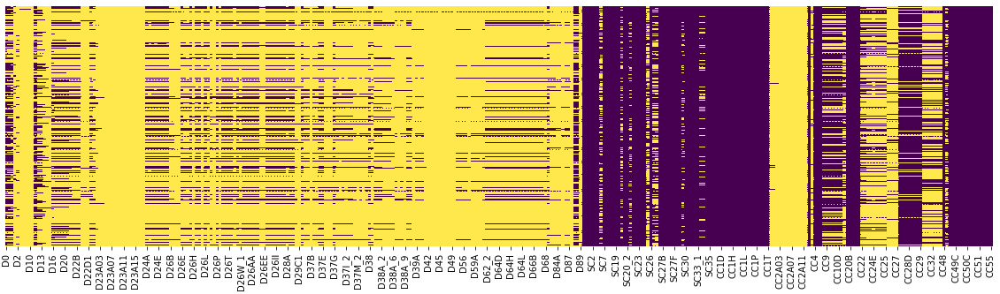
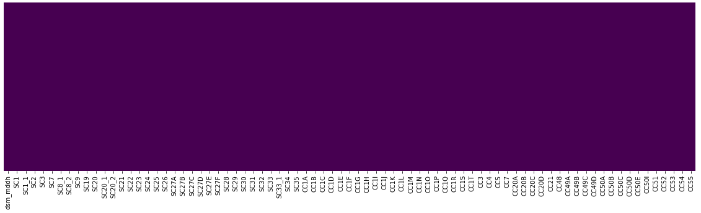

# lap1
# DISCIPLINA: Laboratório de Pesquisa 1 - lap1

# TRABALHO 01:  Título do Trabalho
Trabalho desenvolvido durante a disciplina:

# Sumário

### 1. Componentes  
Integrantes do grupo 
Caicke Pinheiro: caicke@gmail.com 
Eduardo Alves Figueiredo: eduardomatanob@gmail.com 
Hellesandro Gonzaga de Carvalho: hellesandro@hotmail.com 

### 2. Apresentação dos Datasets (Clássico + Em estudo) 

Link do colab da base de dados clássica: https://colab.research.google.com/drive/1yFG-3XkXxVKyuE63siBg9sbx0sAawBf4#scrollTo=VrZN-PDgFXO7 

>#### 2.1 Visão geral da base de dados clássica: 
 * **P:** Seus dados são sobre o que?
    > **R:** Base de dados com informações sobre os tripulantes do Titanic.

* **P:** O que você deseja com este conjunto de dados?
  
  > **R:** Predizer se um indivíduo sobreviveu, com base nos dados do embarque.

* **P:** Quais são os tipos de atributos existentes e qual é o atributo alvo?
    > **R:** Survived é o alvo e o restante ajudará a predizer.

    | nome_atributo | tipo_atributo | descricao |
    | :------------ |:--------------:|---------:|
    | PassengerId  | Qualitativo nominal| Apenas um ID |
    | Survived     | Qualitativo nominal| Sobreveu sim ou não |
    | Pclass       | Qualitativo ordinal| Classe econômica (1, 2 3) |
    | Name       | Qualitativo nominal| Nome do passageiro |
    | Sex       | Qualitativo nominal| Sexo do passageiro |
    | Age       | Quantitativo discreto| Idade do passageiro |
    | SibSp       | Quantitativo discreto| # de irmãos/conjuges a bordo |
    | Parch       | Quantitativo discreto| # de pais/filhos a bordo |
    | Ticket       | Qualitativo nominal| Número do ticket |
    | Fare       | Quantitativo contínuo| Taxa do passageiro |
    | Cabin       | Qualitativo nominal| Número da cabine |
    | Embarked       | Qualitativo nominal| Local de embarque |

 

* **P:** Quais são os problemas existentes? 
    > **R:** Não achamos uma correlação muito clara entre dois atributos, pela tabela de correlações, o que nos ajudaria na predição. Além disso, alguns campos no formato de
texto nos atrapalharam na hora de realizar predições.

 

>#### 2.2 Visão geral da base de dados em estudo: 

* **P:** seus dados são sobre o que?
    > **R:** Transtorno comum (Depressão)

* **P:** o que você deseja com este conjunto de dados? 
    > **R:** Predizer a presença do transtorno de depressão com base em perguntas respondidas por pacientes com comportamento considerado suficiente para diagnóstico do transtorno comum de depressão.
* **P:** quais são os tipos de atributos existentes e qual é o atributo alvo? 
    > **R:** O atributo alvo é o **dsm_mddh**, ele indica o diagnóstico realizado pelo entrevistador em relação a presença da depressão ou não. Considerando que são mais de 300 atributos, nós fizemos alguns pré-processamentos e selecionamos nesse primeiro momento os 10 melhores atributos.  Confira na tabela abaixo:  

    | nome_atributo | tipo_atributo | descricao |
    | :------------ |:-----------:| --------:|
    | SC21  | Qualitativo nominal| Have you ever in your life had a period of tim... |
    | SC22  | Qualitativo nominal| Several days or longer felt discouraged about thing... |
    | SC23 | Qualitativo nominal| Several days or longer lost interest in things enjoyed |
    | CC4  | Qualitativo nominal| During the past 30 days, how many days did you... |
    | CC5  | Qualitativo nominal| During the past 12 months, how many times have... |
    | CC49A  | Quantitativo discreto| # visits doctor past year |
    | CC49C  | Quantitativo discreto| # visits to medical specialist like cardiologist pa... |
    | CC49D  | Quantitativo discreto| # visits health professional, nurse or nutritionist... |
    | CC54  | Qualitativo nominal| think % people helped by seeing professional emotion... |
    | CC55  | Qualitativo nominal| think % people not get helped who get better |

* **P:** quais são os problemas existentes? 
    > **R:** Muitos NaN, num primeiro momento decimos por não tratá-los e sim tentar convergir um modelo com as mais características que possuem poucou ou nenhum NaN. É bem provável que existam outliers mas não chegamos neste passo, também pareceu que valores de porcentagem não foram representados com vírgula, por exemplo, um valor 99,8 aparece como 998. Foi uma análise muito breve, esse 998 também pode na verdade significar "não sei", são avaliações que pretendemos fazer para o próximo esforço de sprint.   

* qualidade e clareza: garantir que a semântica dos atributos seja clara (nomes coerentes com os dados, se necessário renomear atributos).

### 3.Pré-processamento dos Datasets  

Realize o Pré-processamento e Tratamento de Dados em sua base/dataset.

#### 3.1 Pré-processamento e tratamento na base de dados clássica: 
<ul>
    <li>nós eliminamos o campo <i>nome</i> da nossa base de treinos e testes, pois o nome completo
    iria nos atrapalhar na hora de realizar predições.</li>
    <li>Como o campo <i>cabin</i> possuía 687 valores nulos, nós também o desconsideramos.</li>
    <li>O campo <i>embarked</i> só possuía três valores distintos, então usamos um label encoder "manualmente" e transformamos
    os valores em números (1, 2 ou 3). Além disso, removemos os dois registros que possuíam um valor nulo para <i>embarked</i>.</li>
    
</ul>

 

>#### 3.2 Pré-processamento e tratamento na base de dados em estudo: 
* Nós removemos as colunas completamente na presença de apenas um NaN ou mais. Não é a melhor abordagem mas foi feito para atender o prazo, esse é um corte bem significativo que deve ser avaliado antes da aplicação. Essa remoção de NaNs resultou numa redução de 337 atributos para 79;
Note pela cor amarela a quantidade de valores nulos antes e depois.
###### Antes

###### Depois
]

* Com o objetivo de diminuir ainda mais a quantidade de atributos que serão avaliadas pelo modelo, utilizamos um método de seleção de características do `sklearn` chamado `SelectKBest`, selecionando dos 79 atributos, apenas 10. É um chute inicial ainda não sabemos se essa é uma quantidade suficiente para atingir boas métricas no modelo. Os atributos selecionados estão exibios na seção 2.1 do seu respectivo dataset.

* **TODO:** Ainda existem muitas tarefas de pré-processamentos a serem realizadas bem como a verificação de outliers e validação do domínio dos atributos...

### 4.Análise Exploratória dos datasets 
Explore conjunto de dados por meio de uma ferramenta (EDA), destacando em suas observações o que for considerado mais relevante.

#### 4.1 Análise exploratória na base de dados clássica: 
Usando o Pandas Proffile, conseguimos obter algumas informações relevantes da nossa base clássica: 
[Report_Titanic.pdf](https://github.com/caicke/lap1/files/6153552/Report_Titanic.pdf)

Como já havíamos observado, haviam muitos registros faltando nos campos <i>age</i> e <i>cabin</i>. 
Além disso, através do relatório vimos que o número de <i>zeros</i> nos campos <i>parch</i> (pais e filhos a bordo) e <i>sibsp</i> (irmãos/conjuges a bordo) eram maioria em seus respectivos campos (76,1% e 68,2%, respectivamente), provando que a maioria dos passageiros não possuíam nenhum tipo de parentesco entre eles.

>#### 4.2 Análise exploratória na base de dados em estudo: 
>...  **TO DO**  
Sugestão: Utilizar ferramentas como Pandas Proffile e Sweetviz , Seaborn e Matplotlib  
    
[Tutorial básico com Seaborn](https://github.com/profmoisesomena/escience_and_tools/blob/master/seaborn/Seaborn_introduction.ipynb "Seaborn Introduction")

># Marco de Entrega 01: Itens do Sprint 01  
    
### 5.Estudo dos algoritmos previamente definidos para a pesquisa
  (explicação/teoria) 
  >#### 5.1 Visão geral sobre cada um dos algoritmos: 
    A) Explicação sobre o algoritmo/método de classificação adotado
    (como funciona, performance/complexidade para treino e para execução, etc...)
    B) Estudar e apresentar exemplo de aplicações com algoritmos
    C) Existem requisitos/premissas necessárias para aplicação do algoritmo, quais são?
    D) Aplicar os modelos estudados em bases de dados clássicas como Iris/Titanic 
    (no caso de desejar utilizar outra base consultar o professor)
    
>#### 5.2 Qual dos algoritmos estudados (não visão do grupo, com base nos resultados obtidos) é o mais recomendado para a base de dados clássica utilizada (explicar): 
>...
>#### 5.3 Qual dos algoritmos estudados (não visão do grupo) provavelmente será o mais recomendado para a base de dados em estudo (explicar): 
>...

># Marco de Entrega 02: Itens do Sprint 02  
>

### 6.Implementar método no dataset em estudo  (explicação + datasets) 
    A) Explicação sobre o processo de aplicação dos algotítmos em estudo 
    no conjunto de dados em estudo (passos necessários/realizados)
    B) Implementar método nos datasets utilizados comparar resultados obtidos 
    e validar ou descartar hipótese do ítem 5.1 e 5.2.
    
>#### 6.1 Detalhamento dos processos de classificação com base nos algoritmos na base de dados em estudo: 
>...
>

### 7.Análise dos resultados obtidos  
    A) Detalhar conclusões com base nos resultados obtidos
    B) Definir quais trabalhos futuros podem ser realizados a partir das conclusões obtidas e tarefas realizadas.
    
>#### 7.1 Conclusões com base nos resultados obtidos: 
>...
>#### 7.2 Trabalhos futuros: 
>...
>
### 8. Resultados e Artefatos
>#### 8.1 Slides Finais
>#### 8.3 Demais artefatos solicitados pelo professor

># Marco de Entrega 03: Conclusão das atividades  

### 9 FORMATACAO NO GIT:  
https://help.github.com/articles/basic-writing-and-formatting-syntax/
<comentario no git>
    
##### About Formatting
    https://help.github.com/articles/about-writing-and-formatting-on-github/
    
##### Basic Formatting in Git
    
    https://help.github.com/articles/basic-writing-and-formatting-syntax/#referencing-issues-and-pull-requests
    
    
##### Working with advanced formatting
    https://help.github.com/articles/working-with-advanced-formatting/
#### Mastering Markdown
    https://guides.github.com/features/mastering-markdown/

    
### OBSERVAÇÕES IMPORTANTES

#### Todos os arquivos que fazem parte do projeto (Imagens, pdfs, arquivos fonte, etc..), devem estar presentes no GIT. Os arquivos do projeto vigente não devem ser armazenados em quaisquer outras plataformas.
1. <strong>Caso existam arquivos com conteúdos sigilosos<strong>, comunicar o professor que definirá em conjunto com o grupo a melhor forma de armazenamento do arquivo.

#### Todos os grupos deverão fazer Fork deste repositório e dar permissões administrativas ao usuário do git "profmoisesomena", para acompanhamento do trabalho.

#### Os usuários criados no GIT devem possuir o nome de identificação do aluno (não serão aceitos nomes como Eu123, meuprojeto, pro456, etc). Em caso de dúvida comunicar o professor.

Link para curso de GIT 

