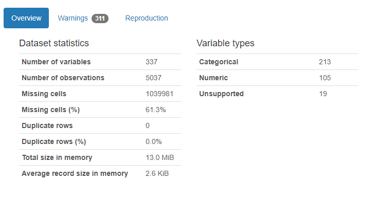

# lap1
# DISCIPLINA: Laboratório de Pesquisa 1 - lap1

# TRABALHO 01:  Título do Trabalho
Trabalho desenvolvido durante a disciplina:

# Sumário

### 1. Componentes  
Integrantes do grupo 
Caicke Pinheiro: caicke@gmail.com 
Eduardo Alves Figueiredo: eduardomatanob@gmail.com 
Hellesandro Gonzaga de Carvalho: hellesandro@hotmail.com 

### 2. Apresentação dos Datasets (Clássico + Em estudo) 

Link do colab da base de dados clássica: https://colab.research.google.com/drive/1yFG-3XkXxVKyuE63siBg9sbx0sAawBf4#scrollTo=VrZN-PDgFXO7 

>#### 2.1 Visão geral da base de dados clássica: 
 * **P:** Seus dados são sobre o que?
    > **R:** Base de dados com informações sobre os tripulantes do Titanic.

* **P:** O que você deseja com este conjunto de dados?
  
  > **R:** Predizer se um indivíduo sobreviveu, com base nos dados do embarque.

* **P:** Quais são os tipos de atributos existentes e qual é o atributo alvo?
    > **R:** Survived é o alvo e o restante ajudará a predizer.

    | nome_atributo | tipo_atributo | descricao |
    | :------------ |:--------------:|---------:|
    | PassengerId  | Qualitativo nominal| Apenas um ID |
    | Survived     | Qualitativo nominal| Sobreveu sim ou não |
    | Pclass       | Qualitativo ordinal| Classe econômica (1, 2 3) |
    | Name       | Qualitativo nominal| Nome do passageiro |
    | Sex       | Qualitativo nominal| Sexo do passageiro |
    | Age       | Quantitativo discreto| Idade do passageiro |
    | SibSp       | Quantitativo discreto| # de irmãos/conjuges a bordo |
    | Parch       | Quantitativo discreto| # de pais/filhos a bordo |
    | Ticket       | Qualitativo nominal| Número do ticket |
    | Fare       | Quantitativo contínuo| Taxa do passageiro |
    | Cabin       | Qualitativo nominal| Número da cabine |
    | Embarked       | Qualitativo nominal| Local de embarque |

 

* **P:** Quais são os problemas existentes? 
    > **R:** Não achamos uma correlação muito clara entre dois atributos, pela tabela de correlações, o que nos ajudaria na predição. Além disso, alguns campos no formato de
texto nos atrapalharam na hora de realizar predições.

 

>#### 2.2 Visão geral da base de dados em estudo: 

* **P:** seus dados são sobre o que?
    > **R:** Transtorno comum (Depressão)

* **P:** o que você deseja com este conjunto de dados? 
    > **R:** Predizer a presença do transtorno de depressão com base em perguntas respondidas por pacientes com comportamento considerado suficiente para diagnóstico do transtorno comum de depressão.
* **P:** quais são os tipos de atributos existentes e qual é o atributo alvo? 
    > **R:** O atributo alvo é o **dsm_mddh**, ele indica o diagnóstico realizado pelo entrevistador em relação a presença da depressão ou não. Considerando que são mais de 300 atributos, nós fizemos alguns pré-processamentos e selecionamos nesse primeiro momento os 10 melhores atributos.  Confira na tabela abaixo:  

    | nome_atributo | tipo_atributo | descricao |
    | :------------ |:-----------:| --------:|
    | SC20  | Qualitativo nominal| Had attack of fear/panic |
    | SC21  | Qualitativo nominal| Have you ever in your life had a period of tim... |
    | SC22  | Qualitativo nominal| Several days or longer felt discouraged about thing... |
    | SC23 | Qualitativo nominal| Several days or longer lost interest in things enjoyed |
    | SC25  | Qualitativo nominal| Several days or longer very irritable/grumpy/bad mood |
    | SC26  | Qualitativo nominal| Worried a lot more about things than other people |
    | CC4  | Quantitativo discreto| During the past 30 days, how many days did you... |
    | CC20A  | Qualitativo nominal| Problems getting to sleep past 12 months |
    | CC49B  | Quantitativo discreto| # visits to a psychiatrist past 12 months |
    | CC49C  | Quantitativo discreto| # visits to medical specialist like cardiologist pa... |

* **P:** quais são os problemas existentes? 
    > **R:** O maior problema foi a grande quantidade de NaN, principalmente nas questões que são diretamente relacionadas com a depressão, porém decidimos por não tratá-los diretamente e sim tentar convergir um modelo com as demais características que possuem poucou ou nenhum NaN.   

* qualidade e clareza: garantir que a semântica dos atributos seja clara (nomes coerentes com os dados, se necessário renomear atributos).

### 3.Pré-processamento dos Datasets  

Realize o Pré-processamento e Tratamento de Dados em sua base/dataset.

>#### 3.1 Pré-processamento e tratamento na base de dados clássica: 
<ul>
    <li>nós eliminamos o campo <i>nome</i> da nossa base de treinos e testes, pois o nome completo
    iria nos atrapalhar na hora de realizar predições.</li>
    <li>Como o campo <i>cabin</i> possuía 687 valores nulos, nós também o desconsideramos.</li>
    <li>O campo <i>embarked</i> só possuía três valores distintos, então usamos um label encoder "manualmente" e transformamos
    os valores em números (1, 2 ou 3). Além disso, removemos os dois registros que possuíam um valor nulo para <i>embarked</i>.
    E o campo <i>embarked</i> foi retirado do dataset</li>
    <li>O campo <i>ticket</i> foi retirado do dataset por representar apenas um código de identificação da passagem.
    Sendo assim, este campo tem uma variação muito grande e acaba não ajudando o algoritmo na sua convergência.</li>
    <li>O campo <i>passengerId</i> foi retirado do dataset por representar apenas uma numeração dos passageiros
    (partindo do um até o numero máximo de passageiros). Sendo assim, este campo tem uma variação muito grande e acaba 
    não ajudando o algoritmo na sua convergência.</li>
    <li>O campo <i>sex</i> foi aplicado a técnica de <i>One Hot Encoding</i>, criando assim dois campos chamados <i>sex_female</i>
    e <i>sex_male</i>. Foi utilizado esta técnica para melhor predição do algoritmo. Além disso, o campo <i>sex</i> foi retirado do dataset.</li>
    <li>Foi imputado no campo <i>age</i> a média das idades deste mesmo campo, onde havia valores nulos.</li>
    <li>Foi aplicada a técnica de <i>Binning</i> no dataset na intenção da obtenção de melhores predições.</li>
    <li>Foi aplicada a técnica de <i>Balanceamento</i> no dataset na intenção da obtenção de melhores predições.</li>
    
</ul>

 

>#### 3.2 Pré-processamento e tratamento na base de dados em estudo: 
##### Remoção de valores nulos
* Nós removemos as colunas completamente na presença de apenas um NaN ou mais. Não é a melhor abordagem mas foi feito para atender o prazo, esse é um corte bem significativo que deve ser avaliado antes da aplicação. Essa remoção de NaNs resultou numa redução de 337 atributos para 79. 
Note pela cor amarela a quantidade de valores nulos antes e depois.
###### Antes

###### Depois

##### Avaliando a presença de Outliers
* Nesta etapa "pegamos um atalho", ao invés de tratar os outliers de todas características disponíveis, nós usamos o método de seleção de características citado na próxima seção **Seleção de características**, ANTES para diminuir o volume de características que deveríamos tratar. 
* Consideramos o cenário em que os dados foram obtidos, nós ignoramos os atributos de valores nominais pois entendemos que seria muito difícil determinar um outlier. Dos atributos numéricos e contínuos nós observamos a presença de valores nominais misturados, nesse caso nós removemos todos os registros com valores nominais em atributos numéricos e contínuos. Essa operação resultou na redução de registros de 5037 para 4223.

Vale ressaltar que esse tipo de manobra é imprudente como um tiro no escuro. Por exemplo, imagine se tivéssemos um atributo com um potencial incrível para o modelo mas que ele está com alta quantidade de outliers, mas outros atributos que são menos interessantes para o modelo tem pouco outlier, é possível que ao aplicar uma seleção de características esse atributo de "potencial incrível" fique de fora. O inverso desse cenário também é verdadeiro dependendo do modelo!

>**SPOILER:** Alguns dos atributos que inicialmente se mostraram melhores, depois da remoção dos outliers, não foram mais relacionados entre as melhores características.

##### Balanceamento do Dataset
* O dataset estava bastante desbalanceado, do total de 4223 registros, 3455 representavam o diagnóstico negativo e apenas 768 para positivo. Sabendo disso, balanceamos o dataset em 50/50, sendo 768 registros de cada diagnóstico. Totalizando 1536 registros.

##### Seleção de características
* Com o objetivo de diminuir ainda mais a quantidade de atributos que serão avaliadas pelo modelo, utilizamos o método de seleção de características do `sklearn` chamado `SelectKBest` combinado com `chi2` para selecionar os 10 melhores atributos dos 79. É um chute inicial ainda não sabemos se essa é uma quantidade suficiente para atingir boas métricas no modelo. Os atributos selecionados estão exibios na seção 2.1 do seu respectivo dataset.

### 4.Análise Exploratória dos datasets 
Explore conjunto de dados por meio de uma ferramenta (EDA), destacando em suas observações o que for considerado mais relevante.

>#### 4.1 Análise exploratória na base de dados clássica: 
Usando o Pandas Proffile, conseguimos obter algumas informações relevantes da nossa base clássica: 
[Report_Titanic.pdf](https://github.com/caicke/lap1/files/6153552/Report_Titanic.pdf)

Como já havíamos observado, haviam muitos registros faltando nos campos <i>age</i> e <i>cabin</i>. 
Além disso, através do relatório vimos que o número de <i>zeros</i> nos campos <i>parch</i> (pais e filhos a bordo) e <i>sibsp</i> (irmãos/conjuges a bordo) eram maioria em seus respectivos campos (76,1% e 68,2%, respectivamente), provando que a maioria dos passageiros não possuíam nenhum tipo de parentesco entre eles.

>#### 4.2 Análise exploratória na base de dados em estudo: 

Sugestão: Utilizar ferramentas como Pandas Proffile e Sweetviz , Seaborn e Matplotlib  
    
[Tutorial básico com Seaborn](https://github.com/profmoisesomena/escience_and_tools/blob/master/seaborn/Seaborn_introduction.ipynb "Seaborn Introduction")
 

###### Antes  
Nós utilizamos o Pandas Profiling, porém o relatório dele é bastante extenso e não encaixa bem para essa explicação. Sendo assim nos contentaremos em explicar através do overview.

* O **número de atributos** presente nesse dataset é bem grande, muito mais que o necessário para convergir um modelo. Por um lado é bom ter uma variedade de opções para escolher os melhores atributos, por outro isso aumenta bastante o trabalho de análise e pré-processamento;
* O **número de registros**, apesar do bom volume, apenas 1536 (30,49%) registros  foram utilizados porque estavam desbalanceados;
* A quantidade de **células faltando** é bem expressiva principalmente nas características mais diretas no assunto depressão;
* Dos **tipos de variáveis** a grande maioria é nominal, inclusive alguns atributos possuem valores categóricos e numéricos, nesses casos nós tratamos.

###### Depois

Considerando a análise anterior, o dataset foi tratado e um novo relatório foi gerado.

* A única consideração que gostaríamos de enfatizar neste relatório é a indicação de **registros duplicados** que acreditamos ser um erro.

* Dos 10 atributos selecionados para o modelo, 2 apareceram no relatório de **Warnings** porém concordamos em desconsiderar o "aviso" pois é possível que os valores sejam 0 com bastante frequência nesses casos (``CC49B`` e ``CC49C``);
* Ainda existe uma preocupação em especial com ``SC2`` e ``CC5`` pois aparentam estar enviesados e de certa forma não tratamos esses casos. Podem ser atributos úteis para um modelo com mais de 10 atributos. 

 

># Marco de Entrega 01: Itens do Sprint 01  
    
### 5.Estudo dos algoritmos previamente definidos para a pesquisa
  
  >#### 5.1 Visão geral sobre cada um dos algoritmos: 
    A) Explicação sobre o algoritmo/método de classificação adotado
    (como funciona, performance/complexidade para treino e para execução, etc...)
    B) Estudar e apresentar exemplo de aplicações com algoritmos
    C) Existem requisitos/premissas necessárias para aplicação do algoritmo, quais são?
    D) Aplicar os modelos estudados em bases de dados clássicas como Iris/Titanic 
    (no caso de desejar utilizar outra base consultar o professor)

>#### 5.1.1 Árvore de decisão

##### A) Explicação sobre o algoritmo/método de classificação adotado

Primeiramente, antes de se utilizar o algoritmo que está sendo analisado, é preciso conceituar este algoritmo de árvore de decisão. Árvore de decisão é um método de aprendizado supervisionado não paramétrico usado para classificação e regressão. Alguns métodos usados pelo algoritmo irão procurar as variáveis que possuem maior relação com a variável target(alvo) e assim, colocá-las no topo da árvore.
Um destes métodos é a entropia. E o que é entropia? Com a entropia, o algoritmo analisa como os nossos dados estão distribuídos nas variáveis preditoras de acordo com a variação do nosso target. De acordo com a entropia, o algoritmo observa o ganho de informação das variáveis. A que tiver um maior ganho de informação vai ser a variável do primeiro nó da árvore. O ganho de informação é a medida do quanto estão relacionados os dados da variável preditora com os dados da nossa target. Outro método também utilizado é o índice GINI, sendo que este método é parecido com a análise da entropia, mudando somente a forma de realização.

Na árvore de decisão existem os nós, os ramos e as folhas. Onde, os nós contêm as perguntas para ser tomada a decisão, os ramos são os caminhos por onde o algoritmo segue e as folhas são os nós que contém uma resposta. O algoritmo irá percorrer a árvore vendo as possibilidades possíveis quando para em cada nó da árvore, toma a decisão certa e assim sucessivamente até parar em nó folha, onde enfim obteve o seu resultado. Isto pode ser considerado aprendizado de máquina? Uma árvore de decisão sozinha não é aprendizado de máquina, já que um ser humano pode criar uma árvore e tomar a decisão por si só. Porém, o processo de construção automática utilizando uma base de dados, é sim, um aprendizado de máquina.

- **Complexidade do algoritmo de árvore de decisão**

    O( n{samples} * n{features} * log(n{samples}) )

    Onde:
    * Log quer dizer o logaritmo de n{samples};
    * O n{samples} quer dizer o número de registros do dataset;
    * n{features} quer dizer o número de colunas do dataset.  

- **Performance para treino e para execução**

    Executando o algoritmo de árvore de decisão na base de dados do Titanic, o tempo de duração obtido foi de 0.0028581619262695312 segundos.

##### B) Estudar e apresentar exemplo de aplicações com algoritmos

<i>Mapeamento digital de classes e atributos de solos</i> é uma técnica para facilitar a coleta, armazenamento, análise, interpretação e confecção de mapas de solos. O uso de técnicas quantitativas para predição espacial em mapeamento de solos e de seus atributos vêm crescendo nesta última década, devido ao avanço dos computadores, o que permite usar de maneira mais rápida e confortável. Uma destas técnicas é justamente o algoritmo de árvore de decisão. 

Onde a figura 3 ilustra as funções de pedotransferência obtidas por árvore de decisão, a partir de um conjunto de dados de solos do sul do Amazonas, para estimar a microporosidade do solo, utilizando-se neste caso, a granulometria e o teor de carbono orgânico.

##### C) Existem requisitos/premissas necessárias para aplicação do algoritmo, quais são?

Não foram encontrados requisitos ou restrições para a aplicação do algoritmo. É preciso somente ter a base de dados na qual será aplicada o algoritmo.

##### D) Aplicar os modelos estudados em bases de dados clássicas como Iris/Titanic

O modelo de árvore de decisão foi aplicado na base de dados Titanic, com o pré-processamento já realizado na base de dados. Pode ser observado no link para o colab abaixo:

Link para o colab: https://colab.research.google.com/drive/1Ij-jIAXwRj1cWMV7I9pRJ0_E-dzli-YO?usp=sharing

Resultado:

 

##### Referências utilizadas para o algoritmo de árvore de decisão:

Mapeamento digital de classes e atributos de solos: métodos, paradigmas e novas técnicas. Disponível em:<https://www.embrapa.br/busca-de-publicacoes/-/publicacao/338308/mapeamento-digital-de-classes-e-atributos-de-solos-metodos-paradigmas-e-novas-tecnicas>. Acessado em: 27/03/2021.

>#### 5.1.2 Random Forest
##### A) Explicação sobre o algoritmo/método de classificação adotado
##### B) Estudar e apresentar exemplo de aplicações com algoritmos
##### C) Existem requisitos/premissas necessárias para aplicação do algoritmo, quais são?
##### D) Aplicar os modelos estudados em bases de dados clássicas como Iris/Titanic
Acesse este [link](https://colab.research.google.com/drive/1dhdpeSFVO1tkbbfjyxLZ1JV41zMx_-Kj?usp=sharing) para ver o jupyter notebook.  
Resultado:

>#### 5.1.3 Regressão Logística
##### A) Explicação sobre o algoritmo/método de classificação adotado
A Regressão Logística é uma técnica de Regressão que nos permite estimar a probabilidade associada à ocorrência de determinado evento (alvo) diante de um conjunto de variáveis explanatórias (características independentes). Sabendo disso, essa técnica pode ser usada para analisar e predizer variáveis do tipo “discreta”, “nominal” e “ordinal”.

- **Características** 
    - Busca estimar a probabilidade da variável dependente (target, y, variável alvo) assumir um determinado valor em função das demais variáveis;
    - O resultado da análise fica contido num intervalo de 0 a 1, podemos traduzir como Falso e Verdadeiro, mas 0 a 1 é como o valor é interpretado num plano em que a função sigmóide é aplicada;
    - Usa o estimador Máxima Verossimilhança ou (maximum-likelihood estimation- MLE);

- **Função Logística**
    - A probabilidade de ocorrência de um evento pode ser estimada diretamente. No caso da variável dependente Y assumir apenas dois possíveis estados (1 ou 0) e haver um conjunto de p variáveis independentes X1, X2, …, Xp, o modelo de regressão logística pode ser escrito da seguinte forma:
    
    onde, 
    

        - Os coeficientes B0 , B1, ..., Bp são estimados a partir do conjunto de dados, pelo método da máxima verossimilhança, em que encontra uma combinação de coeficientes que maximiza a probabilidade da amostra ter sido observada. Utilizando uma certa combinação de coeficientes B e variando os valores de X, observa-se que a curva logística tem um comportamento probabilístico no formato da letra S, o que é uma característica da regressão logística. [(Hosmer e Lemeshow, 1989, Retirado da USP, 2020)](https://edisciplinas.usp.br/pluginfile.php/3769787/mod_resource/content/1/09_RegressaoLogistica.pdf).

            Sendo assim, quando:
            

            

- **Classificação** 
    - se P(Y=1) >= 0.5 então classifica-se Y=1
    - se P(Y=1) < 0.5 então classifica-se Y=1

- **Tipos de Regressão Logística** 

    - Existem 3 tipos, a Binária, Multinomial, Ordinal. Para cada uma delas existe uma adaptação do uso da função logística, que não será coberta por este documento. Mas está explicado neste link: [Asel Mendis (2019)](https://www.kdnuggets.com/2019/01/logistic-regression-concise-technical-overview.html).
        - **Binária**: usada para classificações entre 0 e 1;
        - **Multinomial**: usada para classificações com mais de 2 categorias. Exemplo: maçãs, laranjas, uvas, bananas;
        - **Ordinal**: usada para classificações com mais de 2 categorias, em adição, também para targets que possuem uma ordem natural. Exemplo: Alto, médio, baixo;

- **(BONUS) Visão geral da diferença entre Regressão Linear e Regressão Logística**

    - Diferente da Regressão Linear, a Regressão Logística não supõe que os dados estão [normalizados, que existe linearidade, e homogeneidade de variância](https://www.statisticssolutions.com/assumptions-of-linear-regression/). Esse fato torna o uso da Regressão Logística muito mais amigável, fácil, porque raramente essas suposições são satisfeitas no mundo real.
    Se aplicadas numa mesma base de dados, por exemplo sobre notas de participantes do ENEM. A Regressão Linear poderia predizer a pontuação dos participantes, enquanto a Regressão Logística poderia classificar se o participante foi “aprovado” ou “não aprovado”.

##### B) Estudar e apresentar exemplo de aplicações com algoritmos
- **Aplicações clássicas**
    - [Iris](https://colab.research.google.com/drive/1lWfwpxa5h_oMJECQZ0kNA4hE_fvJ6Cqn?usp=sharing)
    - [Digits, também conhecido como MNIST](https://colab.research.google.com/drive/1lWfwpxa5h_oMJECQZ0kNA4hE_fvJ6Cqn?usp=sharing)
    - [HeartDesease](https://colab.research.google.com/drive/1A3SxCl5_yucnNRDZtHLI-LEzGTyL3qLh?usp=sharing)
- **Aplicação mais complexa**
    - Previsão de risco na área tributária – calcular a probabilidade do contribuinte ser inadimplente ou adimplente após o parcelamento de tributos. [Dias Filho (2003, Retirado da USP, 2020)](https://edisciplinas.usp.br/pluginfile.php/3769787/mod_resource/content/1/09_RegressaoLogistica.pdf)
    - Utilizado para classificar se a empresa encontra-se no grupo de empresas solvente ou insolvente. [Matias (2002, Retirado da USP, 2020)](https://edisciplinas.usp.br/pluginfile.php/3769787/mod_resource/content/1/09_RegressaoLogistica.pdf). 
    - Determinar quais características levam as empresas adotarem o balanced scorecard. [Wanderley (2002, Retirado da USP, 2020)](https://edisciplinas.usp.br/pluginfile.php/3769787/mod_resource/content/1/09_RegressaoLogistica.pdf).

##### C) Existem requisitos/premissas necessárias para aplicação do algoritmo, quais são?
- **Premissas**
    - Recomendada para situações em que a variável dependente (target, y, variável alvo) é de natureza dicotômica ou binária;
    - As variáveis independentes (atributos, classes, x) tanto podem ser categóricas ou não;

##### D) Aplicar os modelos estudados em bases de dados clássicas como Iris/Titanic
Acesse este [link](https://colab.research.google.com/drive/1dhdpeSFVO1tkbbfjyxLZ1JV41zMx_-Kj?usp=sharing) para ver o jupyter notebook.  
Resultado:

>#### 5.2 Qual dos algoritmos estudados (não visão do grupo, com base nos resultados obtidos) é o mais recomendado para a base de dados clássica utilizada (explicar): 
>...

Resultado geral:

>#### 5.3 Qual dos algoritmos estudados (não visão do grupo) provavelmente será o mais recomendado para a base de dados em estudo (explicar): 
>...

># Marco de Entrega 02: Itens do Sprint 02  
>

### 6.Implementar método no dataset em estudo  (explicação + datasets) 
    A) Explicação sobre o processo de aplicação dos algotítmos em estudo 
    no conjunto de dados em estudo (passos necessários/realizados)
    B) Implementar método nos datasets utilizados comparar resultados obtidos 
    e validar ou descartar hipótese do ítem 5.1 e 5.2.
    
>#### 6.1 Detalhamento dos processos de classificação com base nos algoritmos na base de dados em estudo: 
>...
>

### 7.Análise dos resultados obtidos  
    A) Detalhar conclusões com base nos resultados obtidos
    B) Definir quais trabalhos futuros podem ser realizados a partir das conclusões obtidas e tarefas realizadas.
    
>#### 7.1 Conclusões com base nos resultados obtidos: 
>...
>#### 7.2 Trabalhos futuros: 
>...
>
### 8. Resultados e Artefatos
>#### 8.1 Slides Finais
>#### 8.3 Demais artefatos solicitados pelo professor

># Marco de Entrega 03: Conclusão das atividades  

### 9 FORMATACAO NO GIT:  
https://help.github.com/articles/basic-writing-and-formatting-syntax/
<comentario no git>
    
##### About Formatting
    https://help.github.com/articles/about-writing-and-formatting-on-github/
    
##### Basic Formatting in Git
    
    https://help.github.com/articles/basic-writing-and-formatting-syntax/#referencing-issues-and-pull-requests
    
    
##### Working with advanced formatting
    https://help.github.com/articles/working-with-advanced-formatting/
#### Mastering Markdown
    https://guides.github.com/features/mastering-markdown/

    
### OBSERVAÇÕES IMPORTANTES

#### Todos os arquivos que fazem parte do projeto (Imagens, pdfs, arquivos fonte, etc..), devem estar presentes no GIT. Os arquivos do projeto vigente não devem ser armazenados em quaisquer outras plataformas.
1. <strong>Caso existam arquivos com conteúdos sigilosos<strong>, comunicar o professor que definirá em conjunto com o grupo a melhor forma de armazenamento do arquivo.

#### Todos os grupos deverão fazer Fork deste repositório e dar permissões administrativas ao usuário do git "profmoisesomena", para acompanhamento do trabalho.

#### Os usuários criados no GIT devem possuir o nome de identificação do aluno (não serão aceitos nomes como Eu123, meuprojeto, pro456, etc). Em caso de dúvida comunicar o professor.

Link para curso de GIT 

